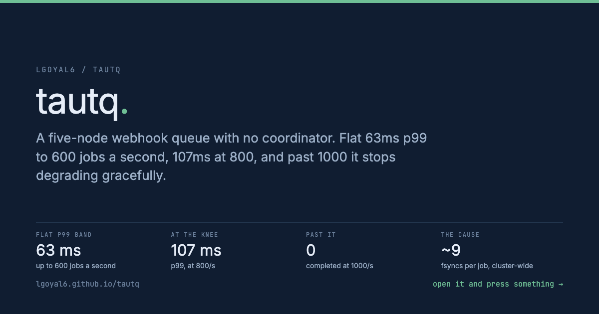
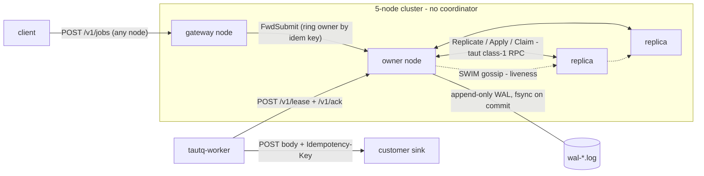
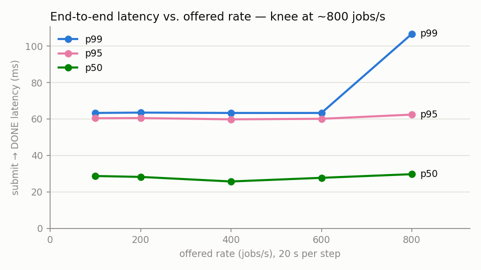
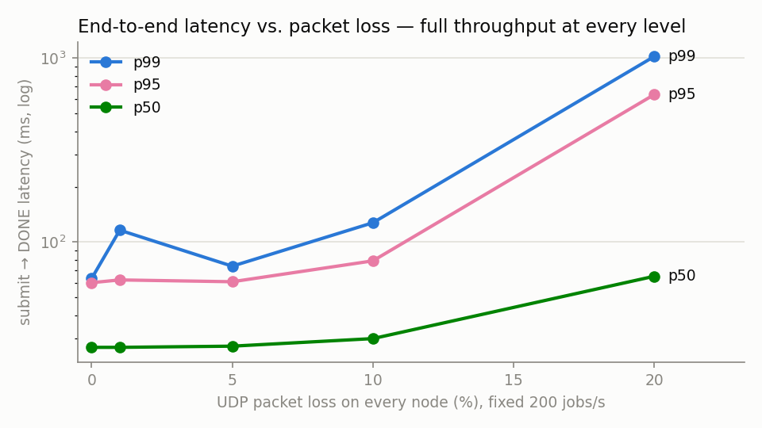

<a href="https://lgoyal6.github.io/tautq/">
  
</a>

**[Open the live demo](https://lgoyal6.github.io/tautq/)** - The ramp, the loss
matrix, and the two suspect rows shown as what they are.

# tautq

[](https://github.com/lgoyal6/tautq/actions/workflows/ci.yml)

A distributed webhook-delivery service - five nodes, **no coordinator** - built on
[taut](https://github.com/lgoyal6/taut), a reliable-UDP transport + SWIM membership library written from scratch.

A job is *"POST this body to this URL with this idempotency key, and retry until a 2xx
comes back."* Submit to any node; the job is fsync-durable on a majority of its 3-node
replica set before the submit is acknowledged; workers lease it under a visibility timeout
with epoch fencing; completion commits on a majority before the worker hears OK.

**Delivery contract: at-least-once execution, exactly-once completion.** Duplicate
deliveries can only come from an expired lease or a failover, and always carry the same
`Idempotency-Key` - the contract real webhook providers publish. Literal
exactly-once-execution is not claimed, because no visibility-timeout system can honestly
claim it.

## Architecture



- **Placement:** consistent-hash ring over the alive membership picks the owner + 2
  replicas **at submit time only**; the set is pinned in the job record forever - no range
  handoff machinery, and idempotency dedup is cross-node under stable membership.
- **Commit rule:** every state transition (SUBMIT / LEASE / DONE / TAKEOVER) is a WAL
  record, fsynced locally and acknowledged by ≥1 replica (W=2 of 3, counting the owner)
  before anyone is told it happened. The lease being majority-committed *before* the grant
  is what makes double-leasing impossible: a partitioned stale owner's records carry a
  stale epoch and no replica will accept them.
- **Failover:** SWIM death verdict → the first alive member of the pinned set claims each
  job (TAKEOVER at epoch+1, majority of the set). Claim grants return the replica's
  pre-claim lease knowledge; because a claim majority intersects every lease majority, a
  committed lease always surfaces - the successor inherits it instead of double-granting,
  and the original worker's token still completes.
- **Recovery:** the WAL replays through the same `apply()` as live commits (replayed state
  ≡ running state, by construction); torn tails truncate; a stale restart resyncs every
  owned job against its replica set and adopts only strictly-advancing copies.
- **Transport:** every arrow above rides taut - per-peer reliable sessions (class 1,
  25 ms RTO floor) demultiplexed off one UDP socket, boot-id handshakes to reset sessions
  across restarts, SWIM for liveness on a second socket. No TCP anywhere in the cluster
  plane; no third-party libraries anywhere at all (HTTP server, WAL, metrics, ring, chaos
  verifier are all in `src/`).

## Chaos matrix

Five-node cluster in network namespaces, submits streaming through rotating gateways
**while each fault is live**; `tautq-verify` then replays every node's WAL, the submit log,
and the sink's receipts, asserting: no accepted job lost, at most one completion per job,
zero unexplained duplicate deliveries. Run it: `./chaos/chaos.sh all` (sudo; used by CI on
every PR).

| Scenario | Fault | Result |
|---|---|---|
| kill | SIGKILL a node + its worker mid-stream, restart later | **PASS** - 59/59 delivered, 0 dupes |
| partition | isolate a 2-node minority for >suspicion timeout, heal | **PASS** - 60/60 delivered, 0 dupes |
| loss | 10 % UDP loss on every node's ingress | **PASS** - 60/60 delivered, 0 dupes |
| stale-log | SIGKILL, chop 400 B off the WAL tail, restart | **PASS** - 59/59 delivered, 0 dupes |

**What the suite caught (and forced us to fix):** the first partition run FAILED - 8
accepted jobs stalled forever. Root cause was in taut's SWIM: a partition held past the
suspicion timeout leaves both sides holding Dead verdicts, Dead members are never probed,
and the accusation's gossip budget was spent into the partition - so after the heal, no
packet ever crosses the link again and the accused never refutes. Permanent split. Fixed
in taut v0.1.2 (one PING per period to a random Dead member, carrying its own Dead rumor
so a live accused refutes and resurrects). The suite also motivated taut v0.1.1: base SWIM
treats Dead as terminal, so a SIGKILLed node could never rejoin at all.

## Performance

Numbers come from the committed CSVs in `bench/` (open-loop generator, latency measured by
the cluster's own submit→DONE histograms, quantiles from scrape deltas). Reproduce:
`bench/ramp.sh` and `bench/loss_matrix.sh`.

### Sustained-rate ramp (knee point)



5-node netns cluster (shared 4-core VM), 20 s per step, `bench/ramp.csv`
(plots regenerate via `python3 bench/plot.py`):

| offered rate | accepted | completed | p50 | p95 | p99 |
|---:|---:|---:|---:|---:|---:|
| 100/s | 2000/2000 | all | 29 ms | 60 ms | 63 ms |
| 200/s | 4000/4000 | all | 28 ms | 61 ms | 64 ms |
| 400/s | 8000/8000 | all | 26 ms | 60 ms | 63 ms |
| 600/s | 12000/12000 | all | 28 ms | 60 ms | 63 ms |
| **800/s** | 16000/16000 | all | 30 ms | 62 ms | **107 ms** |
| 1000+/s | - | - | - | - | *overload collapse* |

**The knee is at ~800 jobs/s**: p99 leaves its flat ~63 ms band (the worker poll interval
plus delivery + two majority commits) and rises to 107 ms. Beyond ~1000/s the cluster does
not degrade gracefully - nodes become intermittently unresponsive (submits and scrapes
time out) and recover only when load drops; those rows are in the CSV, flagged suspect,
deliberately unpublished. The arithmetic says why: each job costs ~9 fsyncs cluster-wide
(SUBMIT/LEASE/DONE on the owner + their replica appends), ≈1.4k fsync/s per node at
800/s - the single-threaded fsync-per-commit design saturates. Group commit
(`Wal::append(sync=false)` + batched `sync()` already exist) is the known next step, not
yet implemented; overload admission control likewise.

### Throughput and p99 vs. packet loss



Fixed 200/s (well under the knee) so loss effects are isolated; loss injected on every
node's UDP ingress; `bench/loss_matrix.csv`:

| UDP loss | accepted | completed | p50 | p95 | p99 |
|---:|---:|---:|---:|---:|---:|
| 0 % | 4000/4000 | all | 27 ms | 60 ms | 63 ms |
| 1 % | 4000/4000 | all | 27 ms | 62 ms | 116 ms |
| 5 % | 4000/4000 | all | 27 ms | 61 ms | 74 ms |
| 10 % | 4000/4000 | all | 30 ms | 79 ms | 127 ms |
| 20 % | 3992/3992 | all | 65 ms | 633 ms | 1019 ms |

Full throughput is sustained at every loss level - taut's 25 ms retransmit floor keeps the
cluster plane tight (p50 only 2.4× worse at 20 % loss). Tail caveats: single 20 s runs, so
the p99 column is noisy in the tail (the 1 % row's p99 landing above the 5 % row's is
sampling noise, not physics).

## Running it

```bash
cmake --preset release && cmake --build --preset release

./scripts/smoke.sh                  # 3-node loopback end-to-end
./chaos/chaos.sh all                # the chaos matrix (sudo, netns)
cd deploy && docker compose up     # 5 nodes + workers + sink + Prometheus + Grafana
```

Grafana (`http://localhost:3000`, provisioned dashboard "tautq"): queue depth, in-flight
leases, replication backlog, membership churn, p50/p95/p99 end-to-end latency,
takeovers/fencing, dead letters.

Submit and watch:

```bash
curl -X POST 'http://localhost:8080/v1/jobs?key=order-42&url=http://172.28.0.9:8090/hook' \
     --data-binary '{"hello":"world"}'
curl http://localhost:8080/v1/jobs/<id>
```

## Honest limitations

- **f = 1.** A job is durable on 2 of 3 nodes at ack time; two simultaneous failures
  inside one replica set can lose an unrepaired job. The third copy is repaired
  asynchronously (`tautq_replication_backlog` gauge).
- **CP on minority partitions.** An owner that cannot reach any replica stalls its jobs
  (submits fail over to reachable owners) rather than risk double execution.
- **Job payloads ≤ 640 B** in v1 - a job is a task descriptor that must fit one taut
  datagram; chunked bodies are future work.
- **No log compaction yet** - segments rotate but completed jobs are never pruned.
- **Dedup is best-effort under churn:** if the ring owner is unreachable at submit, the
  gateway owns the job locally; a concurrent retry through another gateway can create a
  second job with the same idempotency key (the receiver's dedup key still holds).
- Quorum-failed lease attempts consume `lease_seq` (never double-grants, but repeated
  quorum failure can dead-letter a job that never ran; the membership gate + backoff make
  this need ~5 separate partitions to happen).

## Layout

```
src/        wire codec, demux, RPC, WAL, job store, ring, queue protocol, HTTP, metrics,
            binaries: tautq-node / tautq-worker / tautq-sink / tautq-verify / tautq-loadgen
tests/      48 unit/protocol tests over taut's deterministic SimNet (ASan/UBSan)
chaos/      netns cluster harness + the 4-scenario matrix
bench/      load ramp + loss matrix scripts and their CSVs
deploy/     Dockerfile, docker-compose, Prometheus config, Grafana dashboard
docs/       DESIGN-protocol.md (the approved protocol), DECISIONS.md
```
